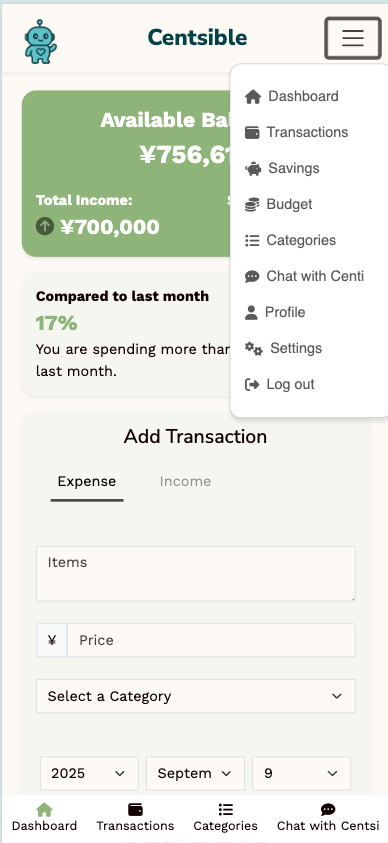
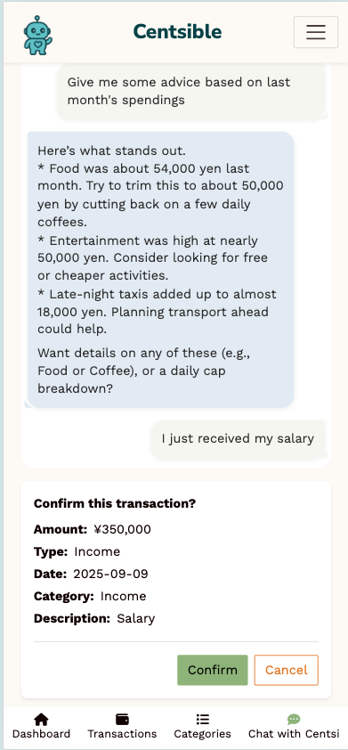
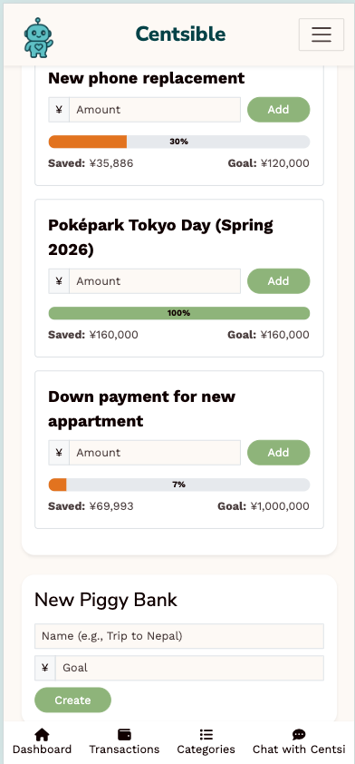

# 💰 Centsible  

**A personal finance app with a friendly AI assistant**  
_Built as the final project of Le Wagon Tokyo Web Development Bootcamp (Batch #2058)_  

---

## 📌 Overview  

Centsible is a **full-stack personal finance application** designed to make managing money simple and approachable.  

Users can **log expenses and income, set savings goals, track budgets, and get AI-powered insights** from **Centi**, the built-in finance assistant.  

Developed over **2 weeks** by a **team of 4 developers**, Centsible demonstrates practical skills in **frontend, backend, databases, and AI integration**.  

---

## ✨ Features  

- ➕ Add transactions (expense/income) via text, receipt photo, or voice  
- 📂 Categorize spending into custom categories  
- 📊 Track monthly budgets and compare with previous months  
- 🐷 Create savings goals (**Piggy Banks**) with visual progress bars  
- 🤖 Chat with **Centi (AI assistant)** for friendly financial advice  
- 📱 Mobile-first design and **Progressive Web App (PWA)** support  

---

## 🛠 Tech Stack  

- **Frontend**: HTML, CSS (Bootstrap 5), JavaScript (Stimulus, Hotwire)  
- **Backend**: Ruby on Rails 7  
- **Database**: PostgreSQL  
- **AI Integration**: RubyLLM with Gemini API  
- **Other**: PWA setup, Heroku deployment  

---

## 🖼 Screenshots  

> _Replace with your actual app screenshots_  

| Dashboard | Chat with Centi | Piggy Banks |
|-----------|-----------------|-------------|
|  |  |  |  

---

## 🚀 Getting Started  

### Prerequisites  
- Ruby 3.2+  
- Rails 7+  
- PostgreSQL  

### Installation  
```bash
# Clone the repo
git clone https://github.com/yourusername/centsible.git
cd centsible

# Install dependencies
bundle install

# Setup the database
rails db:create db:migrate db:seed

# Run the app
bin/dev
```

Then open http://localhost:3000 🎉

---

## 👥 Team & Roles  

Centsible was built as the **final project of Le Wagon Tokyo (Batch #2058)**.  

- [Gaëtan Duquesnoy](https://github.com/GaetanDuq) — Team Lead / Full-Stack Developer  
- [Monika Chrzan](https://github.com/Darrrth) — Frontend / UI  
- [Mandil Khadka](https://github.com/mandilkhadka) — Backend / Database  
- [Stefan Muhsin](https://github.com/Stefanmuhsin) — Backend / AI integration

---

## 📌 Key Learnings  

- Leading a small dev team with task organization in **Notion, Figma, GitHub Projects**  
- Designing a relational database and implementing **ActiveRecord associations**  
- Building interactive features with **Hotwire & Stimulus**  
- Integrating an **LLM** for real-time AI advice  
- Deploying a Rails app as a **Progressive Web App**  

---

## 📄 License  

This project is licensed under the **MIT License**.  

---

✨ **Centsible is the result of teamwork, rapid development, and a strong focus on user experience — demonstrating the ability to bring an idea from concept to production in just 2 weeks.**  

_Rails app generated with [lewagon/rails-templates](https://github.com/lewagon/rails-templates), created by the [Le Wagon coding bootcamp](https://www.lewagon.com) team._  
